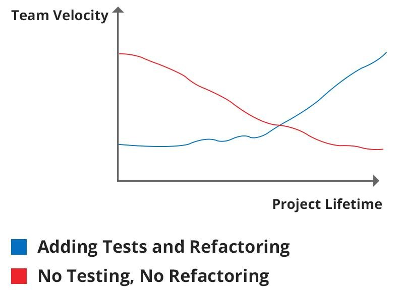

# Test-driven development - I'm feeling lucky
## Intro
I have discussions from time to time with different developers and project managers about a software development process and suggest to use Test-driven development approach as the most effective process with explanation why it is better to use. Mainly, I see that people are very excited about the approach and welcome Test-driven development.

Only sometimes I encounter with a situation as in a picture above ⇈ — either developers or managers do not even want to hear about Test-driven development approach and argue is tough. Usually an argument that “Writing tests are taking too much time… It is impossible to meet deadlines writing tests… Clients do not want to pay for tests” prevails as the final answer in a discussion to use Test-driven development or not. But is it really true that writing tests slows down project’s movement, preventing fast releases, and taking much time?

## Typical development process
Let's take a look at a typical development process of a new feature or modifying an existing one:
1. Define requirements;
2. Write code;
3. Validate the implementation;
4. Perform a regression testing.

First two items are the same for every project if a project has tests or not, but last two items are quite interesting and different when a project has tests or not. Let’s describe different in items 3 and 4 for two cases: *a project has no tests* and *a project has tests*.

## A project has no tests
*Validate the implementation* usually means that a developer manually validates if an implementation of a newly added feature in the project. It is kind of a smoke test — just to see if nothing is broken in a project, it can be compiled, packaged, and run. If a developer sees a desired result then that is it — an implementation is done. All validations here are manual. Of course, internal implementation is known to a developer only and there is no understanding about boundaries.

A QA team should do the rest of validations — validate if a new feature works well externally. Internal validation usually is not a subject. Validation is a complex implementation is a hard and time-consuming task — check if memory used and freed correctly, all edge cases are handled properly and not throwing exceptions, and if the implementation internally as expected.

*Perform a regression testing* means that a developer or QA team has to perform automated or manual regression testing to see if a new feature breaks nothing in the whole project.

The main problems of *Validate implementation* are manual testing and knowledge sharing. Bare implementation contains functionality, but missed knowledge what the implementation can do and how, what are the limitations. It is good if implementation and modification of a feature is done by the same developers, that know how feature works internally. Probably there is no need to express how difficult to different developers to validate the feature change — to understand how a feature was working, if the feature works now without having knowledge just looking at the code is a really complicated task.

## A project has tests
*Validate the implementation* here usually means that a developer runs unit and integration tests to validate the implementation and see if there is no a side effect. The tests here, newly added and existing, will show immediately if something is wrong on any level of the whole project.Failed tests cases should be reviewed and a developer has to understand why the tests are broken and make them working again or modify failed test-cases if a new feature changes business logic. During writing a test-case for an implementation a developer usually puts in a test-cases knowledge how a feature should work: what is a “happy path”, what are edge cases, what happens if incorrect input is passed in and so on.

The main idea in such implementation is start implementation with writing a test and putting knowledge of implementation inside the test-case and implement a new feature iteratively, step by step. That is distinctive feature of Test-driven development approach comparing with just writing a unit test for some implementation.

*Perform a regression testing* means that all test-cases are run and there is no failed tests, and it is done by a developer. This will ensure that a project will work predictably and no misbehavior will appear. If a QA team presented here than QA team will also run some automated functional and integration test-cases to ensure that all flows are working fine.

## The difference between two approaches
Few important aspects could be highlighted here: perform testing of a feature and knowledge sharing about how a feature works internally. These two aspects are affecting time of implementation, modification, refactoring, and all together cost of whole project. Validation is time-consuming task — then why validation is matter of manual testing? Running automated test-cases is many times cheaper than doing manual testing with possibility of overlooking something important.

Transferring business requirements into a test-case, writing a test and an implementation are one solid action and such approach solves few problems:
- shares knowledge of implementation;
- shows boundaries of implementation;
- simplifies regression testing and eliminates blind changes of a feature;
- much harder to add breaking changes unnoticed.

Providing a counter-argument for “Writing tests are taking time, and it is hard to meet deadlines writing them” it would be great to take a look at an image and tell to a counter-party that a project will never meet a deadline some time after start with an approach without reliable and automated testing. Time-consuming is not writing tests, but time-consuming is a validation of even a small change or adding a new feature in a huge project. Without proper testing of project internal implementation it is mostly impossible seeing how a new feature interacts with existing components, how the whole project behaves after the change, and usually after some time it is difficult to manage development of projects without tests.

## When writing tests could take much time?
From my personal experience I would notice probably only one reason why writing tests could take a lot of time - it happens only when developers write an implementation first and then try to cover a newly added implementation with tests. The main principle of Test-driven development approach is to implement a feature iteratively: write a test and an expectation where a test fails, write an implementation when a test passes, refactor to approach an implementation to a desired result and then the cycle repeats. A developer approaches final implementation step by step.

If the Test-driven development approach is disrespected then it leads to cumbersome implementation of test-cases just because it is hard to cover an implementation. Usually in Test-drive development a source code is written from a prospective how painlessly test it. So, following Keep It Simple Stupid (KISS) principle, design patterns, and clean code practices facilitates writing fine-grained source code where every component is small and simple enough to have a small and clean test-case.
A test-case is a place where a developer shares knowledge how an implementation works and what limitations an implementation has.

## Conclusion
Test-driven development approach usually is part of Agile software development practices, but can be used mostly with any development process. In my opinion, writing high quality software is possible only using Test-driven development approach and developers do not spend sleepless nights fixing urgently defects that affect business. Test-driven development approach itself leads to an exciting world of Agile development in cross-functional teams where each member acts as a software developer, analyst, QA engineer with smooth and transparent work on a project.